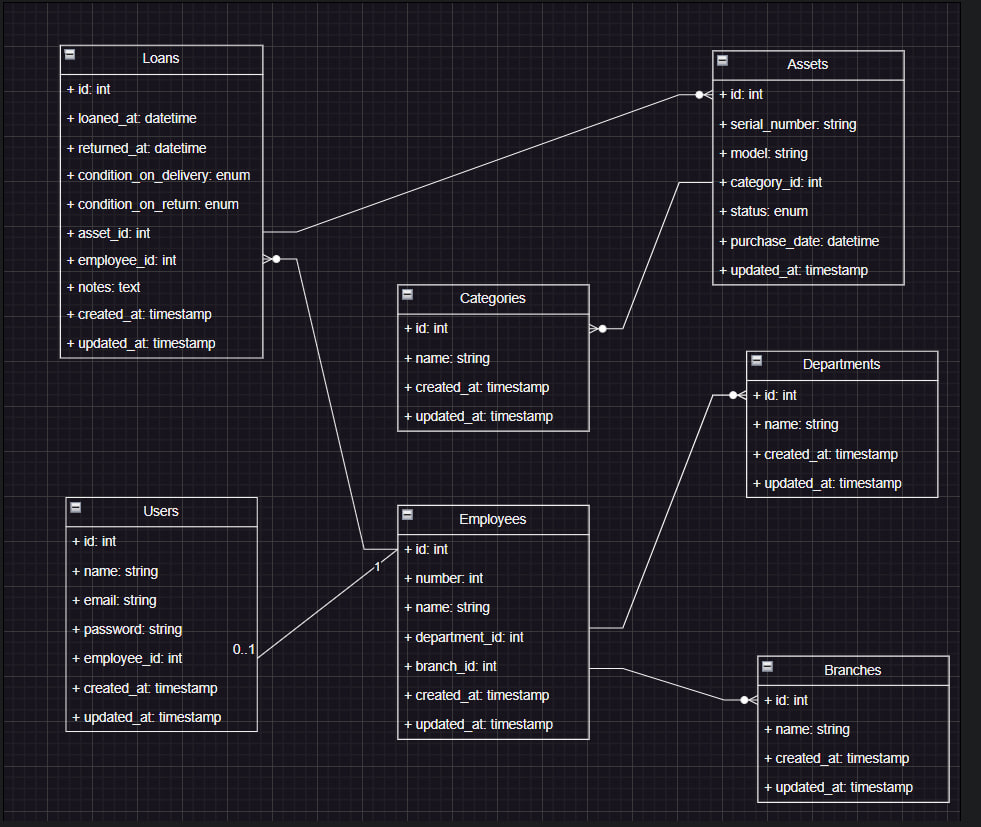

# IT Asset Management System

## Table of Contents
- [Overview](#overview)
- [Requirements](#requirements)
- [Installation & Setup](#installation--setup)
- [Database Schema](#database-schema)
- [Entity Relationships](#entity-relationships)
- [Business Rules & Constraints](#business-rules--constraints)
- [Reports](#reports)
- [Concurrency & Inspection Flow (Requirement #5)](#concurrency--inspection-flow-requirement-5)
- [Tech Stack](#tech-stack)

## Overview
A comprehensive internal system for managing IT assets and tracking their lifecycle across company branches. The system handles asset allocation, returns, technical inspections, and provides intelligent reporting for optimal asset distribution and accountability.

## Requirements
- PHP 8.3+
- Composer
- MySQL 8.0+
- Node.js & NPM
- Laravel 13

## Installation & Setup

1. **Clone the repository:**
   ```bash
   git clone https://github.com/KaramNassar/it_asset_management.git
   cd it_asset_management
   ```

2. **Install dependencies:**
   ```bash
   composer install
   npm install
   ```

3. **Environment configuration:**
   ```bash
   cp .env.example .env
   php artisan key:generate
   ```
   Update your `.env` file with your database credentials:
   ```env
   DB_CONNECTION=mysql
   DB_HOST=127.0.0.1
   DB_PORT=3306
   DB_DATABASE=it_asset_management
   DB_USERNAME=root
   DB_PASSWORD=
   ```

4. **Run migrations:**
   ```bash
   php artisan migrate
   ```

5. **Seed the database (optional):**
   ```bash
   php artisan db:seed
   ```

6. **Build assets:**
   ```bash
   npm run build
   ```

7. **Start the application:**
   ```bash
   php artisan serve
   ```
   Access the dashboard at `http://localhost:8000/dashboard`.
   
   **Default Admin Account (after seeding):**
   - **Email:** `admin@test.com`
   - **Password:** `password`

## Database Schema



*The ERD illustrates the relationships between branches, departments, employees, categories, assets, and loans.*

## Entity Relationships

| Entity | Description | Key Relationships |
|--------|-------------|-------------------|
| **Branch** | Company branch/location | Has many employees |
| **Department** | Organizational department | Has many employees |
| **Employee** | Staff member borrowing assets | Belongs to a branch & department; Has many loans |
| **Category** | Asset type/classification (e.g., Laptop, Monitor) | Has many assets |
| **Asset** | Individual IT equipment item | Belongs to a category; Has many loans; Tracks status |
| **Loan** | Asset borrowing record | Links an employee to an asset; Tracks delivery/return conditions and dates |

## Business Rules & Constraints

1. **Single Asset per Category per Employee:** An employee cannot borrow multiple assets of the same category simultaneously. They must return the current asset before borrowing another from the same category.
2. **Asset Availability Check:** Only assets with `Available` status can be loaned out.
3. **Dual-Asset Validation:** The system validates both the employee's active loans and the asset's current status before confirming a loan.
4. **Technical Condition Tracking:** Every loan records the asset's condition at delivery (`condition_on_delivery`) and at return (`condition_on_return`).

## Reports

The system provides three intelligent reports for asset management insights:

### 1. Heavy Usage Report
Identifies employees who have borrowed more than 3 distinct assets in the last 6 months. Helps monitor asset distribution patterns and identify high-demand users.

### 2. Idle Assets Report
Lists assets that have not been loaned for over a year (or never loaned), including days in stock. Helps identify underutilized inventory for reallocation or disposal.

### 3. Branch Inventory Report
Shows the total count of active assets per category assigned to employees in a selected branch, filtered by "Excellent" delivery condition. Provides branch-level asset accountability.

## Concurrency & Inspection Flow (Requirement #5)

### The Scenario
An employee returns an asset while another employee attempts to borrow it simultaneously. The system must ensure the asset undergoes a mandatory inspection phase before becoming available again, and must track accountability for any discovered damage.

### How the System Solves It

#### 1. Inspection Phase Isolation
When an asset is returned via the `Return` action:
- The loan record is updated with `returned_at` and marked as inactive (`is_active = false`).
- The asset's status is immediately changed to `Maintenance`.
- Both operations are wrapped in a **database transaction** with **row-level locking** (`lockForUpdate()`), preventing race conditions.

Because the loan creation flow only allows assets with `Available` status, any concurrent loan attempts will fail to see or select the asset while it is in `Maintenance`.

#### 2. Post-Inspection Release
After the IT team inspects the device, the `Finish Inspection` action is used:
- The inspector records the returned condition (`condition_on_return`).
- The inspector chooses the next status: `Available`, `Maintenance`, or `Broken`.
- Only when set to `Available` can the asset be loaned out again.

#### 3. Damage Accountability
If damage is discovered during inspection:
- The inspector records it in `condition_on_return` and adds inspection notes.
- The responsible employee is directly identified from the same loan record via `employee_id`.
- The `condition_on_delivery` vs `condition_on_return` comparison clearly shows the asset's state before and after the employee's custody.
- Historical loan records provide a complete audit trail of every handover and inspection.

#### 4. Technical Implementation Details
- **Loan Creation:** Wrapped in `DB::transaction()` with `Asset::lockForUpdate()` to prevent double-booking.
- **Return Process:** Atomic update of loan and asset status prevents intermediate states.
- **Validation Layer:** Form-level validation in `LoanForm.php` provides immediate user feedback, while database-level constraints and transactions ensure data integrity under concurrent load.

## Tech Stack
- **Backend:** Laravel 13 (PHP 8.3+)
- **Admin Panel:** Filament 5
- **Database:** MySQL 8.0+
- **Frontend:** Vite, TailwindCSS
